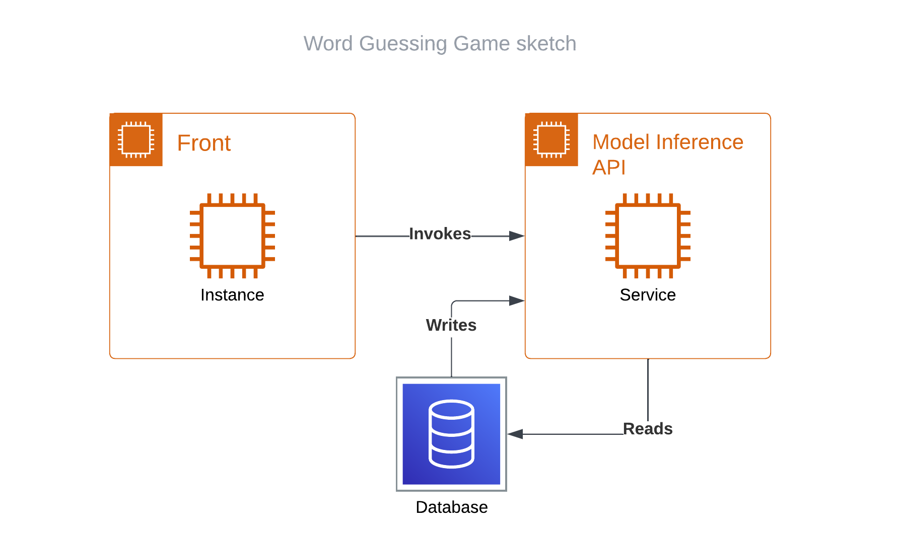

# Приложение Word guessing game
Приложение доступно по [ссылке](http://158.160.24.191:3000).

Идея игры Word guessing game состоит в том, чтобы угадать загаданное слово за неограниченное число попыток.
Алгоритм производит сортировку слов в соответствии с тем, насколько они похожи на загаданное слово.
В основе алгоритма лежит языковая модель `BERT base model`

<center>

</center>

## Состав команды:
- [Русинова Залина](https://github.com/LinkaG) - Тимлид, исследовательская часть, фротенд, бэкэнд
- [Белевский Сергей](https://github.com/bsa7) - реализация консольного приложения, бэкенд, развертывание приложения, настройка github actions
- [Попов Михаил](https://github.com/mik-79-ekb) - написание тестов


## Компоненты архитектуры приложения
Ниже представлен скетч архитектуры приложения.
<center>

</center>

- `Mongo database` хранит в себе коллекции слов и их порядковых номеров для каждой игры, доступной в приложении;

- В компоненте `model_inference_api` происходит загрузка языковой модели `BERT base model`. Для каждого загаданного слова рассчитывается расстояние до всех слов словаря модели, происходит ранжирование слов по вычисленному расстоянию и запись в базу данных. Также `model_inference_api` читает из базы данных различную информацию о записанных коллекциях;

- `fronend` читает записи о количестве игр (коллекций в `Mongo database`) с помощью `model_inference_api` и отображает их во вкладке "Выбрать игру". Также `fronend` по запросу к `model_inference_api` получает порядковый номер слова для выбранной игры и выводит его во время игровой сессии.

Приложение включает в себя следующие компоненты:

| **Component**       | **Source**                                                                                                               | **Docker-compose service ([`docker-compose.yml`](docker-compose.yml))** |
|---------------------|--------------------------------------------------------------------------------------------------------------------------|:-----------------------------------------------------------------------:|
| Mongo database      | ---                                                                                                                      |                                 `mongo`                                 |
| model_inference_api | [`model_inference_api/`](model_inference_api/)                                                                           |                                  `api`                                  |
| frontend_app        | [`frontend_app/`](frontend_app/)                                                                                         |                            `frontend`                                   |


## Запуск приложения
Работающий экземпляр приложения можно открыть по [этой ссылке](http://158.160.24.191:3000).
В первый раз ваш браузер может отобразить предупреждение:

Нажмите кнопку "Перейти на сайт". Откроется сайт:


## Запуск в локальном окружении
> Предварительно запустите mongo командой `docker-compose up mongo`

* Запуск API:
```bash
./script/run_api_dev.sh
```

* Запуск Клиентской части:
```bash
./script/run_front_dev.sh
```

## Запуск в докер-контейнере:

Сервисы и части приложения можно запускать по отдельности, в разных терминалах:


* Запуск API:
```bash
docker-compose up api
```

* Запуск Клиентской части:
```bash
docker-compose up frontend
```

* Запуск mongodb:
```bash
docker-compose up mongo
```

* Запуск nginx:
```bash
docker-compose up nginx
```

* Так же можно комбинировать, например:
```bash
docker-compose up api mongo
```

* Или запустить всё сразу:
```bash
docker-compose up
```

## Деплой приложения

* С локального компьютера
```bash
./deploy/deploy.sh
```
где HOST - ip адрес или DNS имя хоста, на котором будет запущено приложение.

## Запуск тестов

> Перед запуском тестов нужно запустить mongo, например в контейнере: `docker-compose up -d mongo`

* Тесты можно запускать в докер-контейнере:
```bash
./docker/run_tests.sh
```

* Так же тесты можно запускать в локальном окружении:
```bash
poetry run pytest -v
```
