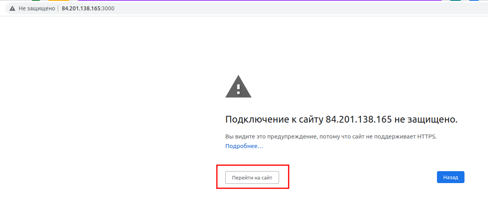
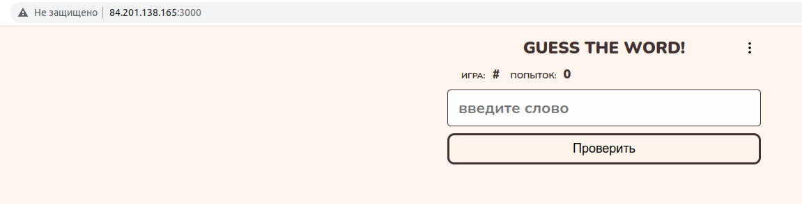

# Приложение
Работающий экземпляр приложения можно открыть по [этой ссылке](http://84.201.138.165:3000).
В первый раз ваш браузер может отобразить предупреждение:

Нажмите кнопку "Перейти на сайт". Откроется сайт:


## Запуск в локальном окружении
> Предварительно запустите mongo командой `docker-compose up mongo`

* Запуск API:
```bash
./script/run_api_dev.sh
```

* Запуск Клиентской части:
```bash
./script/run_front_dev.sh
```

## Запуск в докер-контейнере:

Сервисы и части приложения можно запускать по отдельности, в разных терминалах:


* Запуск API:
```bash
docker-compose up api
```

* Запуск Клиентской части:
```bash
docker-compose up frontend
```

* Запуск mongodb:
```bash
docker-compose up mongo
```

* Запуск nginx:
```bash
docker-compose up nginx
```

* Так же можно комбинировать, например:
```bash
docker-compose up api mongo
```

* Или запустить всё сразу:
```bash
docker-compose up
```

## Деплой приложения

* С локального компьютера
```bash
HOST=84.201.138.165 ./deploy/deploy.sh
```
где HOST - ip адрес или DNS имя хоста, на котором будет запущено приложение.
